# StartupCAN

## Case 1 – Device Update (`current.default=false`, `new.default=false`)

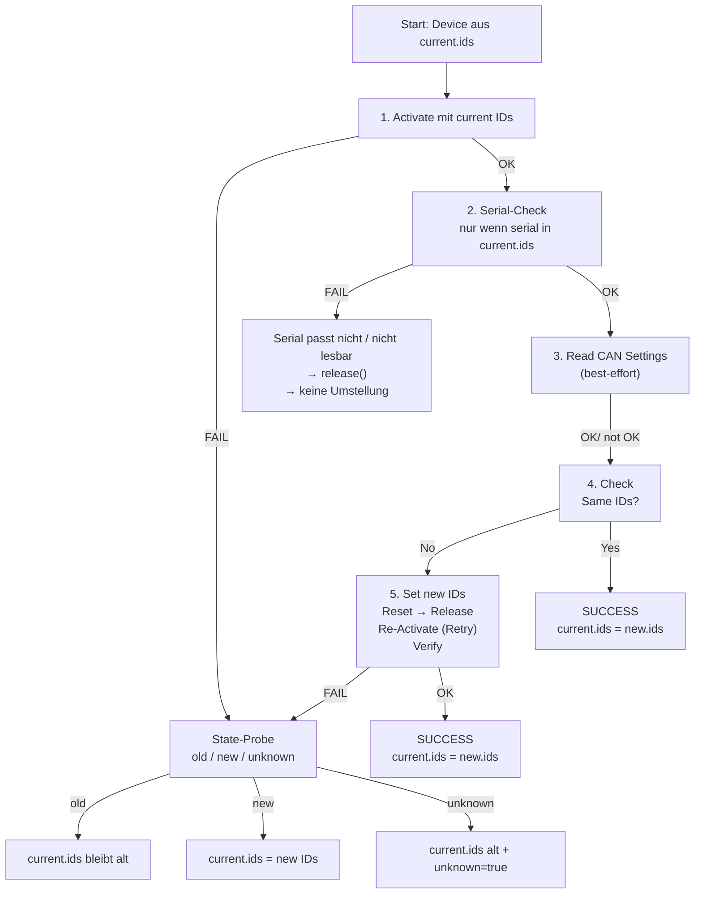

In diesem Modus werden (eindeutige) CAN IDs auf neue eindeutige CAN IDs umgestellt. Zur Sicherheit darf immer nur ein Gerät gleichzeitig am Bus sein. Es wird per `dev_no` gemappt. Jedes Gerät wird nacheinander:

* mit den **current IDs** aktiviert,

* optional geprüft (Seriennummer / CAN-Settings),

* auf die **new IDs** umgestellt,

* per Reset/Release/Re-Activate verifiziert,

* danach wieder released,

* und am Ende wird eine **config.updated.yaml** geschrieben, die den Ist-Zustand abbildet.

### **Ablauf / Reihenfolge (pro Device)**

**Schritt 1 - Activate (current IDs)**

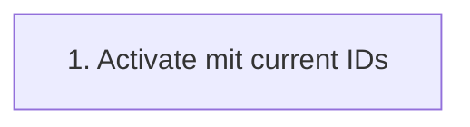

* `activate(dev_no, cmd_id, answer_id)`
* Seriennummer wird gelesen (`get_serial_no`) und geloggt.

Wenn Schritt 1 fehlschlägt: → siehe Fehlerfall **1**.

Wenn Schritt 1 erfolgreich: → weiter mit Schritt **2**. 


**Schritt 2 – Seriennummer-Check (optional, wenn serial in current.ids gesetzt)**

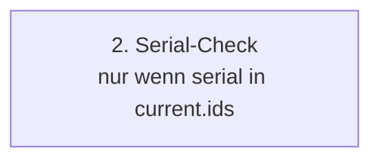

Wenn `devices.config.current.ids` für dieses `dev_no` eine `serial` enthält, muss die gelesene Seriennummer passen:

* 2.1 `sn is None` (SN konnte nicht gelesen werden) → Fehlerfall **2.1**

* 2.2 `sn != expected_sn` → Fehlerfall **2.2**

* Wenn SN ok oder keine SN in YAML gefordert ist → weiter mit Schritt **3**.

Hinweis: In beiden Fehlerfällen ist das Gerät **aktiv gewesen**, deshalb wird **released**.


**Schritt 3 – Read CAN Settings (optional / Best-Effort)**

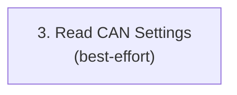

* get_can_settings liest CMD/ANS aus dem Gerät (Index-Konstanten müssen korrekt sein).

* Fehler hier ist **nur eine Warnung** und stoppt den Ablauf nicht.

**Wichtig:** Auch wenn Schritt 3 fehlschlägt, geht es **trotzdem weiter** zu Schritt **4**.


***Schritt 4 - Check same IDs**

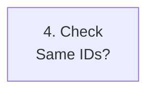

Falls das Gerät bereits die neuen IDs besitzt, wird das Gerät übersprungen. 

Wenn nicht, geht es weiter mit Schritt **5**.


**Schritt 5 – Set IDs → Reset → Release → Re-Activate → Verify → Release**

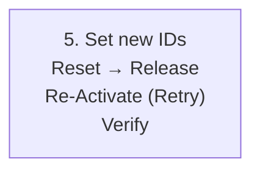

* `set_can_settings(CANSET_CAN_IN_CMD_ID, cmd_new)`

* `set_can_settings(CANSET_CAN_OUT_ANS_ID, ans_new)`

* `reset_device()`

* `release()`

* Re-Activate mit `cmd_new/ans_new` (mit Retry-Logik `_try_activate_n`)

* Verify über `get_can_settings` (Best-Effort)

* abschließendes `release()`

Wenn Schritt 5 erfolgreich ist → Device gilt als **OK / umgestellt**.

Wenn Schritt 5 fehlschlägt → es wird eine **Zustandsprobe** durchgeführt (old/new/unknown) und entsprechend in `config.updated.yaml` eingetragen (siehe Fehlerfall **4**).


### **Fehlerfälle und Verhalten**

**1. Activate (Step 1) schlägt fehl**


**Symptom:** activate funktioniert nicht (Timeout/249/…); keine aktive Session.

**Aktion:**

* Gerät wird **nicht umgestellt**.

* Danach wird “Best-Effort” geprüft, welche IDs tatsächlich aktiv sind:

    * **state = "old"** → Gerät besitzt sehr wahrscheinlich die konfigurierten IDs in `current.ids`. Das erste activate hat nicht geklappt. Jetzt klappt es aber. 

    * **state = "new"** → Gerät ist sehr wahrscheinlich bereits auf neuen IDs

    * **state = "unknown"** → weder old noch new konnte aktiviert werden

* Gerät muss zur Sicherheit vom Bus genommen werden.

**YAML-Update** (`config.updated.yaml`) **abhängig vom state**:

* **state="old"** → `current.ids` bleibt auf alten IDs

* **state="new"** → `current.ids` wird auf neue IDs gesetzt

* **state="unknown"** → `current.ids` bleibt auf alten IDs **und** `unknown: true` wird gesetzt (als Warnflag)

* `new.ids` bleibt unverändert (Ziel bleibt bestehen)


**2. Serial-Check (Step 2) schlägt fehl (nur wenn serial: in current.ids gesetzt ist)**

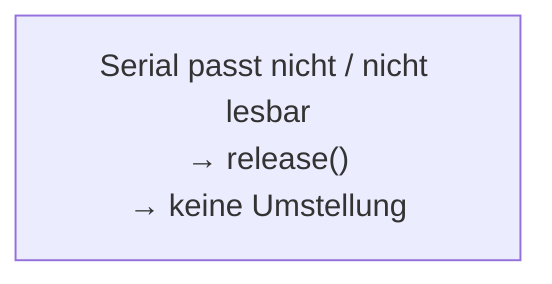
    
**2.1 Seriennummer konnte nicht gelesen werden (sn is None)**

**Aktion:**

* Gerät wird **nicht umgestellt.**

* Gerät muss zur Sicherheit vom Bus genommen werden.

* Es wird `release()` ausgeführt (weil das Gerät aktiv war).

**YAML-Update:**

* `current.ids` bleibt auf den alten IDs; `serial` wird für dieses Gerät **nicht** übernommen (weil unbekannt).

* `new.ids` bleibt bestehen (bei erneutem Run kann es wieder versucht werden).

**2.2 Seriennummer passt nicht (sn != expected_sn)**

**Aktion:**

* Gerät wird **nicht umgestellt** (Schutz vor “falsches Gerät unter falschem dev_no”).

* Gerät muss zur Sicherheit vom Bus genommen werden.

* `release()` wird ausgeführt (weil aktiv).

**YAML-Update:**

* `current.ids` bleibt auf den alten IDs.

* Die gelesene Seriennummer wird in `config.updated.yaml` **mitgeschrieben**, damit man beim nächsten Run die Zuordnung korrigieren kann.

* `new.ids` bleibt bestehen.

**3. Read CAN Settings (Step 3) schlägt fehl**

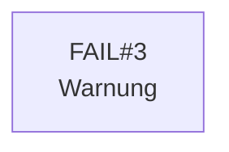

**Aktion:**

* Nur Warnung, **kein Abbruch**.

* Es wird trotzdem **Schritt 4** ausgeführt.

**Interpretation:**

* Index-Konstanten könnten falsch sein, oder Device liefert in diesem Zustand keine Settings.

* Das betrifft nur die Verifikation/Diagnose, nicht zwingend das Umstellen selbst.


**4. Check same ids ergibt: new ids stimmen mit current ids überein**

Das ist genau genommen kein Fehler. Das Device wird lediglich übersprungen.

**Aktion:**

* Gerät wird **nicht umgestellt.**

* Gerät muss zur Sicherheit vom Bus genommen werden.

* `release()` wird ausgeführt (weil aktiv).

**YAML-Update:**

* SUCCESS: in `current.ids` werden neue ids geschrieben (state=new). 


**5. Umstellung/Verify (Step 5) schlägt fehl**


**Aktion:**

* Gerät wird **nicht sicher als umgestellt** markiert.

* Danach wird “Best-Effort” geprüft, welche IDs tatsächlich aktiv sind:

    * **state = "old"** → Gerät ist sehr wahrscheinlich auf den alten IDs geblieben

    * **state = "new"** → Gerät ist sehr wahrscheinlich bereits auf neuen IDs

    * **state = "unknown"** → weder old noch new konnte aktiviert werden

* Gerät muss vom Bus genommenn werden. 

**YAML-Update** (`config.updated.yaml`) **abhängig vom state**:

* **state="old"** → `current.ids` bleibt auf alten IDs

* **state="new"** → `current.ids` wird auf neue IDs gesetzt

* **state="unknown"** → `current.ids` bleibt auf alten IDs **und** `unknown: true` wird gesetzt (als Warnflag)

* `new.ids` bleibt unverändert (Ziel bleibt bestehen)

### **Erfolgsfall**


Wenn ein Gerät erfolgreich umgestellt wurde (`ok=True`):

* `config.updated.yaml` schreibt für dieses Gerät in `current.ids` die **neuen IDs** (und ggf. die Seriennummer).

Wenn **alle** Geräte erfolgreich umgestellt wurden:

* `new.ids` wird in `config.updated.yaml` geleert (und `new.default=false` bleibt).

* Dadurch ist ein erneuter Run “safe” und versucht nicht erneut umzustellen.


## Case 3 - Forced Reset Wizard (`current.default = false`, `new.default = true`)

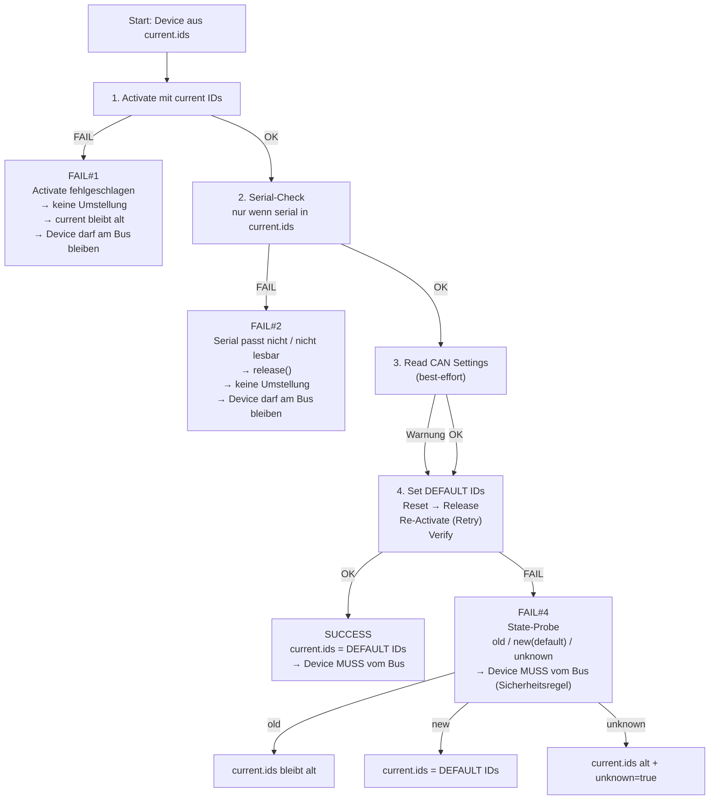

In diesem Modus ist das Ziel **Rücksetzen auf die DEFAULT-CAN-IDs** (`default_cmd_id/default_ans_id`). Dadurch gilt eine harte Bus-Regel:

Sobald ein Gerät auf DEFAULT steht (oder der Zustand unklar ist), **darf es NICHT** gemeinsam mit anderen Geräten am Bus bleiben, weil mehrere Geräte dieselben IDs hätten → Kollisions-/Bus-Off-Risiko.


Darum läuft dieser Modus als Wizard pro Device:

1. Gerät mit **current IDs** aktivieren

2. optional prüfen (Seriennummer / CAN-Settings)

3. auf **DEFAULT IDs** umstellen

4. Reset/Release/Re-Activate verifizieren

5. **Gerät zwingend vom Bus nehmen** (nach Success immer; nach Fail ebenfalls, weil “default/unknown” gefährlich sein kann)

6. am Ende wird eine `config.updated.yaml` geschrieben, die den Ist-Zustand abbildet.


### **Ablauf / Reihenfolge (pro Device)**

**Schritt 1 – Activate (current IDs)** 


* `activate(dev_no, cmd_start, ans_start)`

* Seriennummer wird gelesen (`get_serial_no`) und geloggt.

Wenn Schritt 1 fehlschlägt → Fehlerfall **1**.

Wenn Schritt 1 ok → weiter zu Schritt **2**.


**Schritt 2 – Seriennummer-Check (optional, wenn `serial` in current.ids gesetzt)** 


Wenn `devices.config.current.ids` für dieses `dev_no` eine `serial` enthält, muss sie passen:

* **2.1** `sn is None` → Fehlerfall **2.1**

* **2.2** `sn != expected_sn` → Fehlerfall **2.2**

* Wenn ok (oder keine SN gefordert) → weiter zu Schritt **3**

Hinweis: In beiden Fehlerfällen war das Gerät aktiv → es wird **released**.


**Schritt 3 – Read CAN Settings (optional / Best-Effort)**


* `get_can_settings()` liest CMD/ANS (Index-Konstanten müssen korrekt sein)

* Fehler hier ist **nur Warnung** und stoppt den Ablauf nicht.

Auch wenn Schritt 3 fehlschlägt, geht es weiter zu Schritt **4**.


**Schritt 4 – Set DEFAULT IDs → Reset → Release → Re-Activate → Verify → Release**

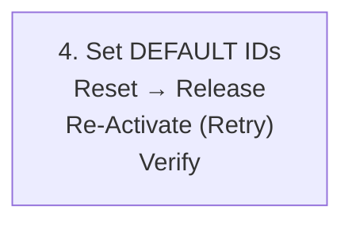

* `set_can_settings(CANSET_CAN_IN_CMD_ID, DEFAULT_CMD_ID)`

* `set_can_settings(CANSET_CAN_OUT_ANS_ID, DEFAULT_ANS_ID)`

* `reset_device()`

* `release()`

* Re-Activate mit DEFAULT IDs (Retry `_try_activate`)

* Verify via `get_can_settings` (Best-Effort)

* abschließendes `release()`

Wenn Schritt 4 erfolgreich → Gerät gilt als **DEFAULT / OK**.

Wenn Schritt 4 fehlschlägt → Fehlerfall **4** (State-Probe).


### **Fehlerfälle und Verhalten**

**1. Activate (Step 1) schlägt fehl**

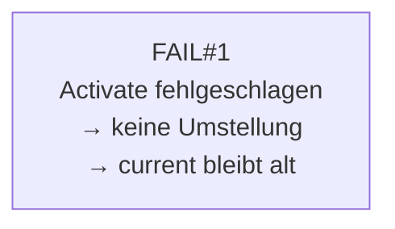

**Aktion:**

* Gerät wird **nicht umgestellt**

* Gerät darf am Bus bleiben (es ist ja weiterhin “current”, also eindeutig)

* `release()` nicht notwendig (keine Session aufgebaut), optional best-effort ok

**YAML-Update:**

* `current.ids` bleibt auf **alten** IDs

* Ziel bleibt bestehen (`new.default=true`), weil Reset-Wizard noch nicht komplett erfolgreich war


**2. Serial-Check (Step 2) schlägt fehl (nur wenn `serial:` in current.ids gesetzt)**

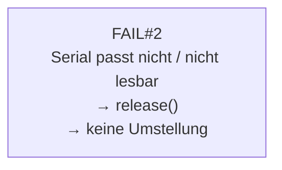

**2.1 Seriennummer konnte nicht gelesen werden (sn is None)**

**Aktion:**

* Gerät wird **nicht umgestellt**

* Gerät darf am Bus bleiben

* `release()` wird gemacht (weil aktiv)

**YAML-Update:**

* `current.ids` bleibt alt

* `serial` nicht übernehmen (unbekannt)

* Ziel bleibt bestehen (`new.default=true`), weil Reset-Wizard noch nicht komplett erfolgreich war

**2.2 Seriennummer passt nicht (sn != expected_sn)**

**Aktion:**

* Schutz: Gerät wird **nicht** umgestellt (falsches Gerät unter falschem dev_no)

* Gerät darf am Bus bleiben

* `release()` (weil aktiv)

**YAML-Update:**

* `current.ids` bleibt alt

* gelesene SN kann optional in `config.updated.yaml` mitgeschrieben werden (für Debug/Zuordnung)

* Ziel bleibt bestehen (`new.default=true`), weil Reset-Wizard noch nicht komplett erfolgreich war


**3. Read CAN Settings (Step 3) schlägt fehl**


**Aktion:**

* Nur Warnung, **kein Abbruch**

* Schritt 4 läuft trotzdem


**4. Umstellung/Verify (Step 4) schlägt fehl → State-Probe + Bus-Sicherheitsregel**

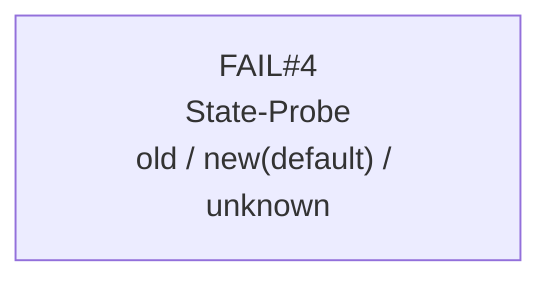

**Aktion:**

* Gerät ist **nicht sicher** als “auf current” oder “auf default” klassifizierbar

* Best-Effort State-Probe:

    * **state="old"** → Device ist sehr wahrscheinlich noch auf old/current IDs

    * **state="new"** → Device ist sehr wahrscheinlich bereits DEFAULT

    * **state="unknown"** → weder old noch default konnte aktiviert werden

**Wichtig (Case-3-Regel):**

* Nach diesem Fehler wird das Gerät **immer vom Bus genommen**, weil:

    * falls es bereits DEFAULT ist → Kollision mit späteren DEFAULT-Devices

    * falls unknown → Risiko, dass es DEFAULT oder “halb umgestellt” ist

**YAML-Update** (`config.updated.yaml`) abhängig vom state:

* **state="old"** → `current.ids` bleibt alt

* **state="new"** → `current.ids = DEFAULT IDs`

* **state="unknown"** → `current.ids` bleibt alt + `unknown: true`


### **Erfolgsfall**

```mermaid
flowchart TD
A["SUCCESS<br/>current.ids = DEFAULT IDs<br/>→ Device MUSS vom Bus"]
```

Wenn `ok=True`:

* `current.ids` wird in `config.updated.yaml` für dieses Gerät auf **DEFAULT IDs** gesetzt

* Gerät wird **zwingend vom Bus genommen** (weil DEFAULT nicht bus-multidevice-fähig ist)


### **Ergebnis am Ende (YAML-Schreiblogik)**

Nach dem Wizard werden die `results` in `config.updated.yaml` übertragen:

* Für jedes Device:

    * `ok=True` → `current.ids = DEFAULT IDs`

    * `ok=False` → je nach `state` (old/new/unknown) wie oben beschrieben

* `current.default`:

    * **true**, wenn **alle** Geräte erfolgreich auf DEFAULT gesetzt wurden

    * sonst **false** (gemischter/teilweiser Zustand möglich)

* `new` wird “safe” gemacht **nur wenn alles OK**:

    * wenn **alle ok**:

        * `new.default = false`

        * `new.ids = []`

    * wenn **irgendeins fail**:

        * `new.default` bleibt **true** (Ziel “reset to default” bleibt bestehen)

        * `new.ids` ist i.d.R. egal/leer, weil `new.default=true` dominiert


## Geräte-Konfiguration (devices.config)

Die Konfiguration besteht aus zwei Listen:

* `devices.config.current` beschreibt den **Ist-Zustand** (mit welchen CAN-IDs die Geräte aktuell erreichbar sind)

* `devices.config.new` beschreibt den **Soll-Zustand** (auf welche CAN-IDs umgestellt werden soll)

Zusätzlich gibt es Default-IDs (Wizard/Reset):

```yaml
devices:
  config:
    assign:
      default_cmd_id: "0x100"
      default_ans_id: "0x101"
``` 

### Allgemeine Regeln

Diese Validierungen werden unabhängig vom Case geprüft:

* `dev_no` **muss pro Liste eindeutig sein**
→ `current.ids` darf keinen `dev_no` doppelt enthalten, ebenso `new.ids`.

* **Pro Gerät muss gelten**: `cmd_id != answer_id`
→ Falls gleich: Konfigurationsfehler.

* **Eindeutigkeit der CAN-ID-Zahlen innerhalb einer Liste**.

    Wenn `new.default=false` gilt die strikte Regel:

    * Keine einzelne Zahl darf doppelt vorkommen (weder cmd-cmd, ans-ans, cmd-ans), da wir eindeutige CAN Zahlen erreichen wollen.

    Aber: wenn `current.default=false`:

    * CAN Zahlen dürfen doppelt vorkommen, da wir alle Geräte einzeln anschließen. 

    Wenn `*.default=true` gilt für die entsprechende CAN ID Liste:

    * Doppelte IDs (default IDs oder current IDs) sind erlaubt, **aber** pro Gerät bleibt `cmd_id != answer_id` Pflicht.

* **Default-IDs dürfen nicht identisch sein**

    `default_cmd_id != default_ans_id` (sonst wäre Default-Betrieb kaputt).

* **Listen dürfen nicht leer sein**

    Wenn `new.default=false` darf die Liste `new.ids` nicht leer sein. Ansonsten gibt es keine neue Zuordnung der IDs.

    Das gleiche gilt für den Fall `current.default=false` mit der Liste `current.ids`.


    Wenn `*.default=true` werden die entsprechenden Listen `*.ids` ignoriert. D.h. sie dürfen unter Anderem auch leer sein. 

* **Umgang mit default IDs in den Listen `*.ids`**

    Wenn `new.default=false` gilt:

    * Default IDs sind in der Liste `new.ids` erlaubt, solange sie nicht doppelt vorkommen. 

    Wenn `current.default=false` gilt:

    * Default IDs sind in der Liste `current.ids` erlaubt. Sie dürfen auch doppelt vorkommen. (Siehe **Eindeutigkeit der CAN-ID-Zahlen innerhalb einer Liste**)


     

### Case 1: `current.default=false` & `new.default=false`

**“Normalbetrieb”** – Umstellung mit Mapping **per dev_no**.

#### Zweck

* Alle Geräte sind schon mit (eindeutigen) `current.ids` erreichbar.

* Die Geräte sollen auf eindeutige `new.ids` umgestellt werden.

* Der Run darf **partial/no-op** sein: einzelne Geräte können unverändert bleiben.

* **Sicherheitsregel**: Auch wenn die Liste `currrent.ids` eindeutige CAN IDs enthält, können wir nicht wissen, ob diese auch korrekt sind. Daher: Es darf erstmal immer nur jeweils ein Gerät am Bus sein. Wenn man sicher ist, dass die eindeutige Liste korrekt ist (z.B. nach einer bereits erfolgreichen Umstellung) können die Geräte auch gleichzeitig am Bus sein. 

#### Zusätzliche Konfigurationsfehler (Case 1) (Ergänzung zu "Allgemeine Regeln" oben)


1. `current.ids`und `new.ids` **enthalten nicht die gleichen dev_no**

    Beispiel: `current` hat 1,2,3 aber `new` hat 1,2,4.

#### Erlaubt in Case 1

* ✅ Die current IDs dürfen doppelt vorkommen, da wir alle Geräte einzeln anschließen.

* ✅ **Partial / No-Op:** Für ein Gerät darf gelten `new == current` (gleiche IDs), d.h. es wird effektiv nicht umgestellt.

* ✅ `current.ids` darf `serial` enthalten (wird für Checks / Logging genutzt).

* ✅ `new.ids` darf `serial` enthalten, wird aber **ignoriert**.
**Mapping passiert immer über** `dev_no`, nicht über `serial`.

    (Im Tool wird dazu ein Hinweis ausgegeben: “serial in new.ids wird ignoriert”.)

* ✅ Eine CAN ID, die in der Liste `current.ids` bereits existiert, darf Ziel ID eines anderen Gerätes sein, solange die Eindeutigkeit in der Liste `new.ids` erfüllt bleibt. 


### Case 2: `current.default=true` & `new.default=false`

Geräte sind (noch) auf Default IDs und müssen **einzeln** umgestellt werden.

#### Zweck

* Geräte werden einzeln angeschlossen (weil alle dieselben Default-IDs haben).

* Ziel-IDs kommen aus `new.ids`.

* Optional kann **SN-Mapping** genutzt werden (wenn in `new.ids` überall serial gesetzt ist).


#### Zusätzliche Konfigurationsfehler (Case 2) (Ergänzung zu "Allgemeine Regeln" oben)


1. **Default-IDs sind ungültig konfiguriert**

    `default_cmd_id == default_ans_id` → verboten.

2. **SN-Mode: Mischbetrieb ist verboten**

    Wenn irgendein Eintrag in `new.ids` `serial` hat, dann müssen **alle** Einträge `serial` haben.

3. **SN-Mode: Seriennummern kommen mehrfach vor** (müssen eindeutig sein)

4. **SN-Mode: ungültige Serial (<0)**

#### Erlaubt in Case 2

* ✅ `current.ids` darf leer sein (wird nicht benötigt)

* ✅ `new.ids` kann **ohne** `serial` betrieben werden → Mapping per `dev_no`

* ✅ `new.ids` kann **mit** `serial` betrieben werden → Mapping per `serial` (SN_MODE=true)

* ✅ Doppelte Default-IDs sind im Startzustand ok (weil `current.default=true`), aber **nie** in den Ziel-IDs.


### Case 3: `current.default=false` & `new.default=true`

**Forced Reset Wizard** – Geräte werden auf Default IDs zurückgesetzt und müssen danach **vom Bus abgenommen werden**.

#### Zweck

* Geräte haben (eindeutige) `current.ids`.

* Jedes Gerät wird nacheinander auf Default zurückgesetzt.

* Sobald ein Gerät Default ist, darf es **nicht** am Bus bleiben (sonst ID-Kollision).

* **Sicherheitsregel**: Auch wenn die Liste `currrent.ids` eindeutige CAN IDs enthält, können wir nicht wissen, ob diese auch korrekt sind. Daher: Es darf erstmal immer nur jeweils ein Gerät am Bus sein. Wenn man sicher ist, dass die eindeutige Liste korrekt ist (z.B. nach einer bereits erfolgreichen Umstellung) können die Geräte auch gleichzeitig am Bus sein. 


#### Zusätzliche Konfigurationsfehler (Case 3) (Ergänzung zu "Allgemeine Regeln" oben)


1. **Default-IDs sind ungültig konfiguriert**

    `default_cmd_id == default_ans_id` → verboten.

#### Erlaubt in Case 3

* ✅ Die current IDs dürfen doppelt vorkommen, da wir alle Geräte einzeln anschließen.

* ✅ `new.ids` darf leer sein und wird ignoriert.

* ✅ `new.ids` darf `serial` enthalten oder nicht – wird ignoriert.

* ✅ `current.ids` darf `serial` enthalten (wird für Check/Logging genutzt).