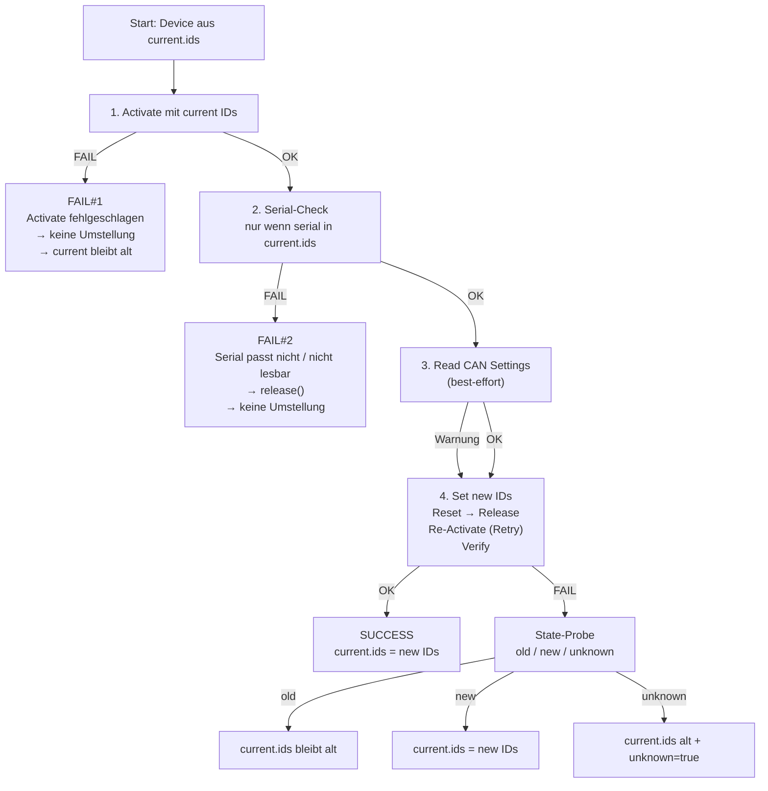

# StartupCAN

## Geräte-Konfiguration (devices.config)

Die Konfiguration besteht aus zwei Listen:

* `devices.config.current` beschreibt den **Ist-Zustand** (mit welchen CAN-IDs die Geräte aktuell erreichbar sind)

* `devices.config.new` beschreibt den **Soll-Zustand** (auf welche CAN-IDs umgestellt werden soll)

Zusätzlich gibt es Default-IDs (Wizard/Reset):

```yaml
devices:
  config:
    assign:
      default_cmd_id: "0x100"
      default_ans_id: "0x101"
``` 

### Allgemeine Regeln (gelten immer)

Diese Validierungen werden unabhängig vom Case geprüft:

* `dev_no` **muss pro Liste eindeutig sein**
→ `current.ids` darf keinen `dev_no` doppelt enthalten, ebenso `new.ids`.

* **Pro Gerät muss gelten**: `cmd_id != answer_id`
→ Falls gleich: Konfigurationsfehler.

* **Eindeutigkeit der CAN-ID-Zahlen innerhalb einer Liste**.

    Wenn `*.default=false` gilt die strikte Regel:

    * Keine einzelne Zahl darf doppelt vorkommen (weder cmd-cmd, ans-ans, cmd-ans).

    Wenn `*.default=true` gilt:

    * Doppelte IDs sind erlaubt (Wizard/Default-Betrieb), **aber** pro Gerät bleibt `cmd_id != answer_id` Pflicht.

* **Default-IDs dürfen nicht identisch sein**

    `default_cmd_id != default_ans_id` (sonst wäre Default-Betrieb kaputt).

### Case 1: `current.default=false` & `new.default=false`

**“Normalbetrieb”** – alle Geräte sind gleichzeitig am Bus, eindeutige IDs, Umstellung mit Mapping **per dev_no**.

#### Zweck

* Alle Geräte sind schon mit eindeutigen `current.ids` erreichbar.

* Die Geräte sollen auf eindeutige `new.ids` umgestellt werden.*

* Der Run darf **partial/no-op** sein: einzelne Geräte können unverändert bleiben.*

#### Konfigurationsfehler (Case 1)

1. `current.ids` **ist leer**

2. `new.ids` **ist leer**

3. `dev_no` **ist doppelt** in `current.ids` oder `new.ids`

4. `current.ids`und `new.ids` **enthalten nicht die gleichen dev_no**

    Beispiel: `current` hat 1,2,3 aber `new` hat 1,2,4.

5. **CAN-IDs in** `current.ids` **sind nicht eindeutig** (strikte Eindeutigkeit bei `current.default=false`)

6. **CAN-IDs in** `new.ids` **sind nicht eindeutig** (strikte Eindeutigkeit bei `new.default=false`)

7. **Eine CAN-ID, die im Bus bereits existiert** (`current.ids`) **wird als Ziel-ID für ein Gerät verwendet, das sich ändern soll**

    → Überschneidung ist verboten **für Geräte, deren IDs sich wirklich ändern**.
(No-op Einträge sind erlaubt, siehe unten.)

8. **Pro Gerät:** `cmd_id == answer_id` (in `current.ids` oder `new.ids`)

#### Erlaubt in Case 1

* ✅ **Partial / No-Op:** Für ein Gerät darf gelten `new == current` (gleiche IDs), d.h. es wird effektiv nicht umgestellt.

* ✅ `current.ids` darf `serial` enthalten (wird für Checks / Logging genutzt).

* ✅ `new.ids` darf `serial` enthalten, wird aber **ignoriert**.
**Mapping passiert immer über** `dev_no`, nicht über `serial`.

    (Im Tool wird dazu ein Hinweis ausgegeben: “serial in new.ids wird ignoriert”.)

* ✅ Default-IDs (z.B. 0x100/0x101) dürfen in Case 1 vorkommen, **solange sie innerhalb der Liste nicht doppelt vorkommen** und nicht zu Bus-Kollisionen führen (durch die strikte Eindeutigkeit sind Kollisionen normalerweise schon ausgeschlossen).

### Case 2: `current.default=true` & `new.default=false`

**Wizard-Modus (Initial Assign)** – Geräte sind (noch) auf Default IDs und müssen **einzeln** umgestellt werden.

#### Zweck

* Geräte werden einzeln angeschlossen (weil alle dieselben Default-IDs haben).

* Ziel-IDs kommen aus `new.ids`.

* Optional kann **SN-Mapping** genutzt werden (wenn in `new.ids` überall serial gesetzt ist).

#### Konfigurationsfehler (Case 2)

1. `new.ids` **ist leer**

2. `dev_no` **ist doppelt in** `new.ids`

3. **CAN-IDs in** `new.ids` **sind nicht eindeutig** (strikte Eindeutigkeit bei `new.default=false`)

4. `new.ids` **enthält Default-IDs** (`default_cmd_id` oder `default_ans_id`)

    → verboten, weil Ziel-IDs eindeutig sein müssen.

5. **Pro Gerät:** `cmd_id == answer_id` (in `new.ids`)

6. **SN-Mode: Mischbetrieb ist verboten**

    Wenn irgendein Eintrag in `new.ids` `serial` hat, dann müssen **alle** Einträge `serial` haben.

7. **SN-Mode: Seriennummern kommen mehrfach vor** (müssen eindeutig sein)

8. **SN-Mode: ungültige Serial (<=0)**

#### Erlaubt in Case 2

* ✅ `current.ids` darf leer sein (wird im Wizard-Modus nicht benötigt)

* ✅ `new.ids` kann **ohne** `serial` betrieben werden → Mapping per `dev_no`

* ✅ `new.ids` kann **mit** `serial` betrieben werden → Mapping per `serial` (SN_MODE=true)

* ✅ Doppelte Default-IDs sind im Startzustand ok (weil `current.default=true`), aber **nie** in den Ziel-IDs.

### Case 3: `current.default=false` & `new.default=true`

**Forced Reset Wizard** – Geräte werden auf Default IDs zurückgesetzt und müssen danach **vom Bus abgenommen werden**.

#### Zweck

* Geräte haben eindeutige `current.ids` und können am Anfang gleichzeitig am Bus hängen.

* Jedes Gerät wird nacheinander auf Default zurückgesetzt.

* Sobald ein Gerät Default ist, darf es **nicht** am Bus bleiben (sonst ID-Kollision).

#### Konfigurationsfehler (Case 3)

1. `current.ids` **ist leer**

2. `dev_no` **ist doppelt in** `current.ids`

3. **CAN-IDs in** `current.ids` **sind nicht eindeutig** (strikte Eindeutigkeit bei `current.default=false`)

4. `current.ids` **enthält bereits Default-IDs** (`default_cmd_id` oder `default_ans_id`)
 
    → verboten, weil sonst schon ein Default-Gerät am Bus wäre / Reset-Wizard kollidiert.

5. **Pro Gerät:** `cmd_id == answer_id` (in `current.ids`)

6. **Default-IDs sind ungültig konfiguriert**

    `default_cmd_id == default_ans_id` → verboten.

#### Erlaubt in Case 3

* ✅ `new.ids` darf leer sein und wird ignoriert.

* ✅ `new.ids` darf `serial` enthalten oder nicht – wird ignoriert.

* ✅ `current.ids` darf `serial` enthalten (wird für Check/Logging genutzt).


## Case 1 – Multi-Device Update (`current.default=false`, `new.default=false`)



In diesem Modus dürfen **alle Geräte gleichzeitig am CAN-Bus** betrieben werden, weil `devices.config.current.ids` eindeutige CAN-IDs enthält. Jedes Gerät wird nacheinander:

1. mit den **current IDs** aktiviert,

2. optional geprüft (Seriennummer / CAN-Settings),

3. auf die **new IDs** umgestellt,

4. per Reset/Release/Re-Activate verifiziert,

5. danach wieder released,

6. und am Ende wird eine **config.updated.yaml** geschrieben, die den Ist-Zustand abbildet.

### **Ablauf / Reihenfolge (pro Device)**

**Schritt 1 - Activate (current IDs)**

* `activate(dev_no, cmd_id, answer_id)`
* Seriennummer wird gelesen (`get_serial_no`) und geloggt.

Wenn Schritt 1 fehlschlägt: → siehe Fehlerfall **1**.

Wenn Schritt 1 erfolgreich: → weiter mit Schritt **2**. 


**Schritt 2 – Seriennummer-Check (optional, wenn serial in current.ids gesetzt)**

Wenn `devices.config.current.ids` für dieses `dev_no` eine `serial` enthält, muss die gelesene Seriennummer passen:

* 2.1 `sn is None` (SN konnte nicht gelesen werden) → Fehlerfall **2.1**

* 2.2 `sn != expected_sn` → Fehlerfall **2.2**

* Wenn SN ok oder keine SN in YAML gefordert ist → weiter mit Schritt **3**.

Hinweis: In beiden Fehlerfällen ist das Gerät **aktiv gewesen**, deshalb wird **released**.


**Schritt 3 – Read CAN Settings (optional / Best-Effort)**

* get_can_settings liest CMD/ANS aus dem Gerät (Index-Konstanten müssen korrekt sein).

* Fehler hier ist **nur eine Warnung** und stoppt den Ablauf nicht.

**Wichtig:** Auch wenn Schritt 3 fehlschlägt, geht es **trotzdem weiter** zu Schritt **4**.


**Schritt 4 – Set IDs → Reset → Release → Re-Activate → Verify → Release**

* `set_can_settings(CANSET_CAN_IN_CMD_ID, cmd_new)`

* `set_can_settings(CANSET_CAN_OUT_ANS_ID, ans_new)`

* `reset_device()`

* `release()`

* Re-Activate mit `cmd_new/ans_new` (mit Retry-Logik `_try_activate_n`)

* Verify über `get_can_settings` (Best-Effort)

* abschließendes `release()`

Wenn Schritt 4 erfolgreich ist → Device gilt als **OK / umgestellt**.

Wenn Schritt 4 fehlschlägt → es wird eine **Zustandsprobe** durchgeführt (old/new/unknown) und entsprechend in `config.updated.yaml` eingetragen (siehe Fehlerfall **4**).

### **Fehlerfälle und Verhalten**

1. **Activate (Step 1) schlägt fehl**

**Symptom:** activate funktioniert nicht (Timeout/249/…); keine aktive Session.

**Aktion:**

* Gerät wird **nicht umgestellt.**

* Gerät darf am Bus bleiben.

* Ein `release()` ist nicht notwendig (weil keine aktive Session aufgebaut wurde; optional kann man trotzdem “best-effort” releasen, aber nicht nötig).

**YAML-Update:**

* In `current.ids` bleiben die bisherigen IDs (aus YAML) für dieses Gerät erhalten.

* `new.ids` bleibt unverändert (Ziel bleibt weiter bestehen).

2. **Serial-Check (Step 2) schlägt fehl (nur wenn serial: in current.ids gesetzt ist)**

    2.1 **Seriennummer konnte nicht gelesen werden (sn is None)**

**Aktion:**

* Gerät wird **nicht umgestellt.**

* Gerät darf am Bus bleiben.

* Es wird `release()` ausgeführt (weil das Gerät aktiv war).

**YAML-Update:**

* `current.ids` bleibt auf den alten IDs; `serial` wird für dieses Gerät **nicht** übernommen (weil unbekannt).

* `new.ids` bleibt bestehen (bei erneutem Run kann es wieder versucht werden).

    2.2 **Seriennummer passt nicht (sn != expected_sn)**

**Aktion:**

* Gerät wird **nicht umgestellt** (Schutz vor “falsches Gerät unter falschem dev_no”).

* Gerät darf am Bus bleiben.

* `release()` wird ausgeführt (weil aktiv).

**YAML-Update:**

* `current.ids` bleibt auf den alten IDs.

* Die gelesene Seriennummer wird in `config.updated.yaml` **mitgeschrieben**, damit man beim nächsten Run die Zuordnung korrigieren kann.

* `new.ids` bleibt bestehen.

3. **Read CAN Settings (Step 3) schlägt fehl**

**Aktion:**

* Nur Warnung, **kein Abbruch**.

* Es wird trotzdem **Schritt 4** ausgeführt.

**Interpretation:**

* Index-Konstanten könnten falsch sein, oder Device liefert in diesem Zustand keine Settings.

* Das betrifft nur die Verifikation/Diagnose, nicht zwingend das Umstellen selbst.

4. **Umstellung/Verify (Step 4) schlägt fehl**

**Aktion:**

* Gerät wird **nicht sicher als umgestellt** markiert.

* Danach wird “Best-Effort” geprüft, welche IDs tatsächlich aktiv sind:

    * **state = "old"** → Gerät ist sehr wahrscheinlich auf den alten IDs geblieben

    * **state = "new"** → Gerät ist sehr wahrscheinlich bereits auf neuen IDs

    * **state = "unknown"** → weder old noch new konnte aktiviert werden

* Gerät darf am Bus bleiben (Case 1 hat eindeutige IDs; unknown ist allerdings ein Warnzustand).

**YAML-Update** (`config.updated.yaml`) **abhängig vom state**:

* **state="old"** → `current.ids` bleibt auf alten IDs

* **state="new"** → `current.ids` wird auf neue IDs gesetzt

* **state="unknown"** → `current.ids` bleibt auf alten IDs **und** `unknown: true` wird gesetzt (als Warnflag)

* `new.ids` bleibt unverändert (Ziel bleibt bestehen)

### **Erfolgsfall**

Wenn ein Gerät erfolgreich umgestellt wurde (`ok=True`):

* `config.updated.yaml` schreibt für dieses Gerät in `current.ids` die **neuen IDs** (und ggf. die Seriennummer).

Wenn **alle** Geräte erfolgreich umgestellt wurden:

* `new.ids` wird in `config.updated.yaml` geleert (und `new.default=false` bleibt).

* Dadurch ist ein erneuter Run “safe” und versucht nicht erneut umzustellen.