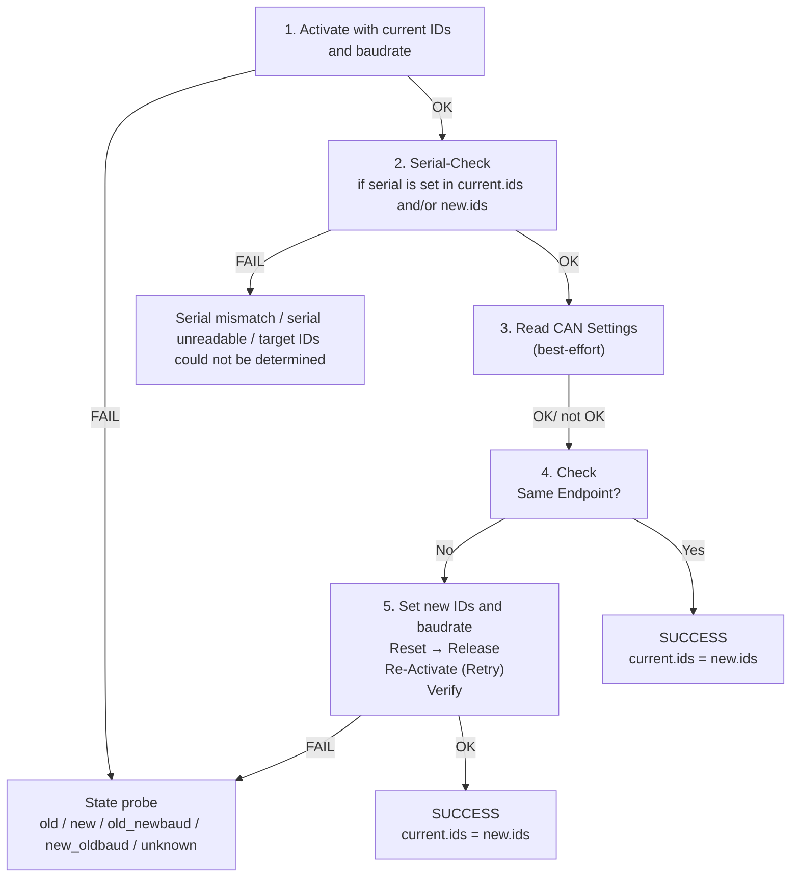
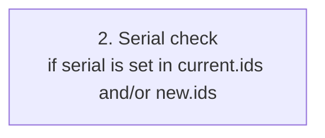
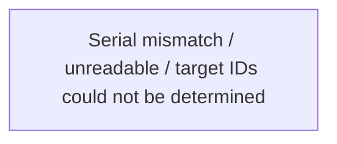

# StartupCAN

StartupCAN is a headless CAN startup and reconfiguration tool for GSV CAN devices.

It is designed to configure devices directly over the CAN bus, without requiring USB access and without using GSVmulti for the actual reconfiguration workflow.


## What is this application for?

StartupCAN is useful when you want to:

- reassign CAN IDs of one or more devices
- move devices from default CAN settings to unique CAN settings
- reset devices back to default CAN settings
- apply a defined target configuration from YAML
- generate an updated YAML file that reflects the actual device state after a run
- prepare devices for Open Source applications like the GSV86CAN Viewer (https://github.com/me-systeme/GSV86CANViewer)

The tool is especially useful in production, commissioning, service, or recovery workflows where devices are connected over CAN and should be handled one by one in a controlled and reproducible way.


## Advantages

StartupCAN has several practical advantages:

- fully scriptable and reproducible workflow
- YAML-based source of truth for current and target CAN settings
- automatic creation of `config.updated.yaml`
- supports partial success and interrupted runs
- detects and records uncertain states via state probing
- well-structured error handling with clear logs for diagnosis and recovery
- supports mapping by `dev_no` or by `serial`


## Workflow overview




## Requirements

StartupCAN requires:

- Python 3.10 or newer (32 bit)
- access to the GSV CAN DLL / Python wrapper used in your project
- a working CAN interface
- a valid YAML configuration
- physical access to connect **only one device at a time** during the workflow

Recommended:

- a known and stable CAN bus setup
- correct baudrate configuration in YAML
- a backup of the original configuration before running


## Getting started

### 1. Prepare the YAML configuration

StartupCAN uses a YAML configuration with:

- `devices.config.current`
- `devices.config.new`
- `devices.config.assign`
- `dll.canbaud`

For more information see the section "Device configuration".

### 2. Decide which case you want to run

StartupCAN supports three operating modes depending on:

* `current.default`

* `new.default`

These combinations define the workflow.

### 3. Connect only one device

For safety, only **one device at a time** should be connected to the CAN bus during the startup/reconfiguration process.

### 4. Python dependencies

Install the required Python packages:

```bash
pip install ruamel.yaml
```

### 5. Run the script

Run the startup script and follow the terminal prompts.

```bash
python run.py
```

### 6. Check `config.updated.yaml`

After the run, StartupCAN writes a `config.updated.yaml` file that reflects the actual detected state of the devices.


## Operating modes

###  Case 1 – Device Update (`current.default=false`, `new.default=false`)

In this mode, devices with already configured CAN IDs are reassigned to new unique CAN IDs. The baudrate is changed to the baudrate defined in `dll.canbaud` in the YAML.

For safety, only one device may be connected at a time.

Mapping is done either by:

* `dev_no`, or

* `serial` from `new.ids`

Each device is processed sequentially:

* activated using the **current IDs** and **current baudrate**

* optionally checked (serial number / CAN settings)

* changed to the **new IDs** and **new baudrate**

* verified via reset / release / re-activate

* released afterwards

* finally written into `config.updated.yaml` as the actual state

At the end, devices **may be connected together on the bus**.


### Case 2 – Default mode (`current.default=true`, `new.default=false`)

In this mode, devices start with the default CAN IDs and default baudrate and are reassigned to new unique CAN IDs and the baudrate from `dll.canbaud`.

For safety, only one device may be connected at a time.

Mapping is done either by:

* `dev_no`, or

* `serial` from `new.ids`

The `current.ids` list is ignored.

Each device is processed sequentially:

* activated using the **default IDs** and **default baudrate**

* optionally checked (serial number / CAN settings)

* changed to the **new IDs** and **new baudrate**

* verified via reset / release / re-activate

* released afterwards

* finally written into `config.updated.yaml` as the actual state

At the end, devices **may be connected together on the bus**.


### Case 3 - Forced Reset Wizard (`current.default = false`, `new.default = true`)


In this mode, the goal is to reset devices back to the default CAN settings:

* `default_cmd_id`

* `default_ans_id`

* `default_canbaud`

For safety, only one device may be connected at a time.

The `new.ids` list is ignored.

Each device is processed sequentially:

* activated using the **current IDs** and **current baudrate**

* optionally checked (serial number / CAN settings)

* changed to the **default IDs** and **default baudrate**

* verified via reset / release / re-activate

* released afterwards

* written into `config.updated.yaml` as the actual state


At the end, devices **must not be connected together on the bus**.
 


## Old (`current`) vs new (`new`) CAN Settings


### Case 1:

* **old IDs** are the IDs in `current.ids`

* **old baudrate** is either the baudrate in `current.ids` or `dll.canbaud` as fallback

* **new IDs** are the IDs in `new.ids`

* **new baudrate** is the baudrate in `dll.canbaud`
 

### Case 2:

* **old IDs** are the **default IDs**

* **old baudrate** is the **default baudrate**

* **new IDs** are the IDs in `new.ids`

* **new baudrate** is the baudrate in `dll.canbaud`


### Case 3:

* **old IDs** are the IDs in `current.ids`

* **old baudrate** is either the baudrate in `current.ids` or `dll.canbaud` as fallback

* **new IDs** are the **default IDs**

* **new baudrate** is the **default baudrate**


## State Probe

A state probe checks which CAN settings are most likely currently active on the device.

Possible states:


* **state = "old"** → device most likely still has the **old IDs** and **old baudrate**

* **state = "new"** → device most likely already has the **new IDs** and **new baudrate**

* **state = "old_newbaud"** → device has the **old IDs** and the **new baudrate**

* **state = "new_oldbaud"** → device has the **new IDs** and the **old baudrate**

* **state = "unknown"** → neither old nor new nor mixed states could be activated successfully


### YAML update behavior depending on state:

`config.updated.yaml` is written based on the detected state:

* **state="old"** → `current.ids` remains on **old IDs** and **old baudrate**

* **state="new"** → `current.ids` is updated to **new IDs** and **new baudrate**

* **state = "old_newbaud"** → `current.ids` is updated with **old IDs** and **new baudrate**

* **state = "new_oldbaud"** → `current.ids` is updated with **new IDs** and **old baudrate**

* **state="unknown"** → `current.ids` remains on **old IDs** and **old baudrate**, and `unknown: true` is added as a warning flag


## Detailed process


### Step 1 – Activate (current IDs and baudrate)


* `activate(dev_no, cmd_id, answer_id, canbaud=start_baud)`
* serial number is read via `get_serial_no` and logged

If Step 1 fails, a **state probe** is performed (see **Failure Case 1**).

If Step 1 succeeds, continue with **Step 2**.


### Step 2 – Serial check (optional)



**Case 1 + 3**: 

If `devices.config.current.ids` contains a `serial` for this `dev_no`, the read serial number must match.

* **2.1** `sn is None` → serial could not be read (see **Failure Case 2.1**)

* **2.2** `sn != expected_sn` → serial mismatch (see **Failure Case 2.2**)


**Case 1 + 2**: 

If all entries in `new.ids` contain a `serial`, the target mapping can be done by serial instead of by `dev_no`.

* **2.3** `_target_ids(dev_no, sn)` failed → target IDs could not be determined (see **Failure Case 2.3**)

If serial is valid or no serial is required, continue with **Step 3**.

Note: in all serial-check failure cases the device had already been activated, so it must be released.


### Step 3 – Read CAN settings (optional / best effort)


* `get_can_settings` reads CMD ID / ANS ID / baudrate from the device

* if this fails, only a warning is printed

**Important:** failure here does **not** stop the workflow.

The script still continues with **Step 4**.


### Step 4 – Check same endpoint


If the device already has the target IDs and target baudrate, it is skipped.

Otherwise the workflow continues with **Step 5**.


### Step 5 – Set IDs and baudrate → Reset → Release → Re-Activate → Verify → Release


* `set_can_settings(CANSET_CAN_IN_CMD_ID, cmd_new)`

* `set_can_settings(CANSET_CAN_OUT_ANS_ID, ans_new)`

* `set_can_settings(CANSET_CAN_BAUD_HZ, int(baud_new))`

* `reset_device()`

* `release()`

* re-Activate using `cmd_new / ans_new / baud_new`

* verify via `get_can_settings`

* final `release()`

If Step 5 succeeds, the device is considered **successfully reconfigured**.

If Step 5 fails, a **state probe** is performed and the resulting state is written into `config.updated.yaml`. (see **Failure Case 5**).


### Success case


If a device was successfully reconfigured (`ok=True`):

* `config.updated.yaml` stores the new IDs

* optionally the serial number and baudrate are also stored

If **all** devices were successfully reconfigured:

* `new.ids` is cleared in `config.updated.yaml` 

* `new.default=false` is written

* this makes the next run safe and prevents accidental repeated reconfiguration

For baudrate:

* baudrate is no longer written into current.ids if the run fully succeeded

* the correct baudrate is then implicitly defined by either:

    * `dll.canbaud`, or

    *  the default baudrate, depending on the case

**Case 1 + 2:** devices may now be connected **together** on the bus.

**Case 3:** devices must **not** be connected **together** on the bus.


## Failure cases and behavior

### 1. Activate (Step 1) fails


**Symptom:** 

* `activate` fails 

* no active session could be established

**Action:**

* a **state probe** is performed

* `current.ids` is updated according to the detected state

* the device is **not reconfigured**

* the device must be removed from the bus

* `new.ids` and `new.default` remain unchanged


### 2. Serial check (Step 2) fails



**Case 1 + 3:**

**2.1 Serial number could not be read (`sn is None`)**

**Action:**

* device is not **reconfigured**

* device must be removed from the bus

* `release()` is executed

**YAML update:**

* `current.ids` remains on the old IDs 

* the original `serial` entry is kept

* `new.ids` and `new.default` remain unchanged

**2.2 Serial number does not match (`sn != expected_sn`)**

**Action:**

* device is **not reconfigured**

* device must be removed from the bus

* `release()` is executed

**YAML update:**

* `current.ids` remains on the old IDs

* the read serial number is written into `config.updated.yaml` 

* `new.ids` and `new.default` remain unchanged


**Case 1 + 2:**

**2.3 SN mode: target IDs could not be determined**

**Action:**

* device is **not reconfigured**

* device must be removed from the bus

* `release()` is executed

**YAML update:**

* `current.ids` remains on the old IDs

* the read serial number is written into `config.updated.yaml`

* `new.ids` and `new.default` remain unchanged


### 3. Read CAN settings (Step 3) fails


**Action:**

* warning only

* the process continues with Step 4

**Interpretation:**

* index/constants may be wrong

* or the device may not provide settings in this state

This affects verification/diagnostics, but not necessarily reconfiguration itself.


### 4. Same endpoint detected


This is not really a failure. The device is simply skipped.

**Action:**

* device is **not reconfigured**

* device must be removed from the bus

* `release()` is executed

**YAML update:**

* treated as success

* `current.ids` is written with the new IDs and new baudrate (`state="new"`)


### 5. Reconfiguration / verify (Step 5) fails


**Aktion:**

* device is **not safely marked as reconfigured**

* a **state probe** is performed

* `current.ids` is updated according to the detected state

* device must be removed from the bus

* `new.ids` and `new.default` remain unchanged


## Device configuration (`devices.config`)

The configuration consists of two main lists:

* `devices.config.current` describes the **actual current state**:

```yaml
    current: 
      default: false
      ids:
        - dev_no: 1
          cmd_id: "0x102"
          answer_id: "0x103"
        - dev_no: 2
          cmd_id: "0x104"
          answer_id: "0x105"
        - dev_no: 3
          cmd_id: "0x106"
          answer_id: "0x107"
```

or 

```yaml
    current: 
      default: true
      ids: []

```

the list can also contain serials:

```yaml
    current: 
      default: false
      ids:
        - dev_no: 1
          serial: 25455437
          cmd_id: "0x102"
          answer_id: "0x103"
        - dev_no: 2
          serial: 25455423
          cmd_id: "0x104"
          answer_id: "0x105"
        - dev_no: 3
          serial: 25455439
          cmd_id: "0x106"
          answer_id: "0x107"
```

and/or canbauds:

```yaml
    current: 
      default: false
      ids:
        - dev_no: 1
          serial: 25455437
          canbaud: 250000
          cmd_id: "0x102"
          answer_id: "0x103"
        - dev_no: 2
          serial: 25455423
          canbaud: 1000000
          cmd_id: "0x104"
          answer_id: "0x105"
        - dev_no: 3
          serial: 25455439
          canbaud: 250000
          cmd_id: "0x106"
          answer_id: "0x107"
```


* `devices.config.new` describes the **desired target state**:

```yaml
    new:
      default: false
      ids:
        - dev_no: 1
          cmd_id: "0x202"
          answer_id: "0x203"
        - dev_no: 2
          cmd_id: "0x204"
          answer_id: "0x205"
        - dev_no: 3
          cmd_id: "0x206"
          answer_id: "0x207"
```

or

```yaml
    new:
      default: true
      ids: []
```

It can also contain serials (serial mapping):

```yaml
    new:
      default: false
      ids:
        - dev_no: 1
          serial: 25455437
          cmd_id: "0x202"
          answer_id: "0x203"
        - dev_no: 2
          serial: 25455423
          cmd_id: "0x204"
          answer_id: "0x205"
        - dev_no: 3
          serial: 25455439
          cmd_id: "0x206"
          answer_id: "0x207"
```

Additionally, default IDs and a default baudrate are configured:

```yaml
devices:
  config:
    assign:
      default_canbaud: 1000000
      default_cmd_id: "0x100"
      default_ans_id: "0x101"
``` 

For multi-device CAN bus operation, the baudrate should usually be switched to the baudrate from `dll.canbaud`:

```yaml
dll:
  # Maximum number of samples the DLL buffer stores per device read cycle.
  # This value is used to size read_multiple() calls and affects latency/throughput.
  mybuffersize: 300

  # CAN bus baud rate in bits per second.
  canbaud: 250000
```

Supported baudrates are: 

* 1000000, 
* 500000, 
* 250000, 
* 125000, 
* 100000, 
* 50000, 
* 25000.

For multiple devices on one CAN bus, 250000 is recommended.


### General validation rules

These checks are independent of the operating mode:

* `dev_no` must be unique within each list

* for each device: `cmd_id != answer_id`

* default IDs must not be identical:

    * `default_cmd_id != default_ans_id`

* required lists must not be empty:

    * if `new.default=false`, then `new.ids` must not be empty

    * if `current.default=false`, then `current.ids` must not be empty

* if `*.default=true`, the corresponding `*.ids` list is ignored and may be empty

* unknown devices may be marked using `unknown: true` in `current.ids`

* baudrate handling depends on the case and configuration


**CAN ID uniqueness rules**


* If `new.default=false`:

    * target IDs in `new.ids` must be strictly unique

    * no number may occur twice across `cmd_id` and `answer_id`

* If `current.default=false`:

    * duplicates in `current.ids` are allowed because only one device is connected at a time during the process 

* If `*.default=true`:

    * duplicate IDs in the corresponding current/default start state are allowed
    
    * but still cmd_id != answer_id must hold per device

 

**Baudrate rules**

The default baudrate is configured in: 

* `devices.config.assign.default_canbaud`

    
If `current.default=true`:
    
* the device is assumed to use the default baudrate

    
If `current.default=false`:

* devices may optionally define `canbaud` in `current.ids` 
    
* if missing, `dll.canbaud` is used as fallback 

If `new.default=true`:

* baudrate is changed back to the default baudrate

If `new.default=false`:

* baudrate is changed to `dll.canbaud`


### Case-specific rules

**Case 1: `current.default=false` & `new.default=false`**

* `current.ids` and `new.ids` must contain the same `dev_no` 

* SN mode mixed configuration is not allowed:

    * if one entry in `new.ids` has `serial`, all must have `serial`

* duplicate serial numbers in `new.ids` are not allowed

* invalid serial numbers (`< 0`) are not allowed


**Allowed in Case 1:**

* duplicate current IDs are allowed

* partial / no-op devices are allowed (`new == current`) 

* `current.ids` may contain `serial` or `canbaud`

* `new.ids` may contain `serial`

* mapping can happen by `dev_no` or `serial` 


**Case 2: `current.default=true` & `new.default=false`**


* SN mode mixed configuration is not allowed:

    * if one entry in `new.ids` has `serial`, all must have `serial`

* duplicate serial numbers in `new.ids` are not allowed

* invalid serial numbers (`< 0`) are not allowed

**Allowed in Case 2:**

* `current.ids` may be empty

* new.ids may work with or without serial numbers


**Case 3: `current.default=false` & `new.default=true`**


**Allowed in Case 3**

* duplicate current IDs are allowed

* `new.ids` may be empty and is ignored

* `new.ids` may contain serials or not, it is ignored

* `current.ids` may contain serials or canbauds


## Notes

StartupCAN is designed for controlled, reproducible CAN setup workflows.

Even if the YAML contains unique current IDs, StartupCAN still assumes that the actual bus state may differ. Therefore, the safest operating rule is:

**Only one device at a time should be connected during reconfiguration.**