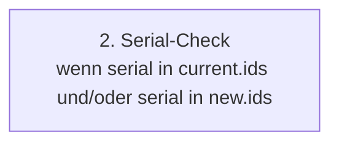
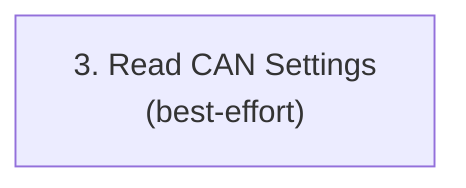
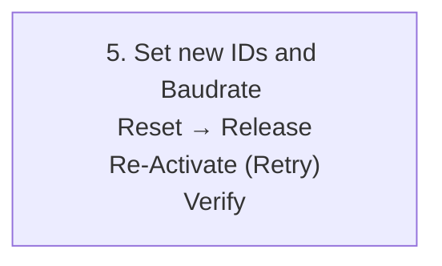
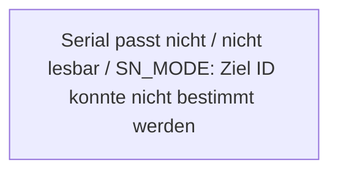

# StartupCAN

Vorteile gegenüber GSVmulti: 

* Das Gerät muss nicht neu gestartet werden

* Kein Anschließen per USB und kein verwenden von GSVmulti


##  Case 1 – Device Update (`current.default=false`, `new.default=false`)
 

In diesem Modus werden (eindeutige) CAN IDs auf neue eindeutige CAN IDs umgestellt und die Baudrate wird auf die Baudrate in `dll.baudrate` aus dem YAML gesetzt. Zur Sicherheit darf immer nur ein Gerät gleichzeitig am Bus sein. Es wird per `dev_no` oder per `serial` aus `new.ids` gemappt. Jedes Gerät wird nacheinander:

* mit den **current IDs** und **current Baudrate** aktiviert,

* optional geprüft (Seriennummer / CAN-Settings),

* auf die **new IDs** und die **neue Baudrate** umgestellt,

* per Reset/Release/Re-Activate verifiziert,

* danach wieder released,

* und am Ende wird eine **config.updated.yaml** geschrieben, die den Ist-Zustand abbildet.

Am Ende dürfen die Geräte **gemeinsam** am Bus sein.


## Case 2 – Default mode (`current.default=true`, `new.default=false`)


In diesem Modus werden die Default CAN IDs und die Default Baudrate auf neue eindeutige CAN IDs und die Baudrate in `dll.canbaud` umgestellt. Zur Sicherheit darf immer nur ein Gerät gleichzeitig am Bus sein. Es wird entweder per `serial` oder per `dev_no` aus `new.ids` gemappt. Die `current.ids` Liste wird ignoriert. Jedes Gerät wird nacheinander:

* mit den **default IDs** und **default Baudrate** aktiviert,

* optional geprüft (Seriennummer / CAN-Settings),

* auf die **new IDs** und **neue Baudrate** umgestellt,

* per Reset/Release/Re-Activate verifiziert,

* danach wieder released,

* und am Ende wird eine **config.updated.yaml** geschrieben, die den Ist-Zustand abbildet.

Am Ende dürfen die Geräte **gemeinsam** am Bus sein.


## Case 3 - Forced Reset Wizard (`current.default = false`, `new.default = true`)


In diesem Modus ist das Ziel **Rücksetzen auf die DEFAULT-CAN-Settings** (`default_cmd_id/default_ans_id/default_canbaud`). Zur Sicherheit darf immer nur ein Gerät gleichzeitig am Bus sein. Die `new.ids` Liste wird ignoriert. Jedes Gerät wird nacheinander:

1. mit den **current IDs** and **Baudrate** aktiviert

2. optional geprüft (Seriennummer / CAN-Settings)

3. auf **DEFAULT IDs** und **DEFAULT Baudrate** umgestellt

4. per Reset/Release/Re-Activate verifiziert

5. danach wieder released

6. am Ende wird eine `config.updated.yaml` geschrieben, die den Ist-Zustand abbildet.

Am Ende dürfen die Geräte **nicht gemeinsam** am Bus sein. 


## Alte (current)/Neue (new) Can-Settings


**Case 1:**

* alte IDs sind die IDs in `current.ids`. Die alte Baudrate ist entweder die Baudrate in `current.ids` oder die `dll.canbaud` (Fallback). 

* neue Ids sind die ids in `new.ids` und die neue Baudrate ist die in `dll.canbaud`.

**Case 2:**

* alte IDs sind die default IDs und die alte Baudrate ist die default Baudrate.

* neue Ids sind die ids in `new.ids` und die neue Baudrate ist die in `dll.canbaud`.

**Case 3:**

* alte IDs sind die IDs in `current.ids`. Die alte Baudrate ist entweder die Baudrate in `current.ids` oder die `dll.canbaud` (Fallback).

* neue IDs sind die default IDs und die neue Baudrate ist die default Baudrate.

## State Probe

Bei einer State Probe wird geprüft, welche IDs tatsächlich aktiv sind:

* **state = "old"** → Gerät besitzt sehr wahrscheinlich die **alten** IDs und **alte** Baudrate.

* **state = "new"** → Gerät ist sehr wahrscheinlich bereits auf **neuen** IDs und **neuer** Baudrate.

* **state = "old_newbaud"** → Gerät hat **alte** IDs und die **neue** Baudrate.

* **state = "new_oldbaud"** → Gerät hat **neue** IDs und die **alte** Baudrate.

* **state = "unknown"** → weder old noch new noch Mischzustände konnten aktiviert werden


YAML-Update (`config.updated.yaml`) abhängig vom state:

* **state="old"** → `current.ids` bleibt auf **alten** IDs und **alter** Baudrate

* **state="new"** → `current.ids` wird auf **neue** IDs und **neue** Baudrate gesetzt

* **state = "old_newbaud"** → `current.ids` wird mit **alter** ID und **neuer** Baudrate aktualisiert.

* **state = "new_oldbaud"** → `current.ids` wird mit **neuer** ID und **alter** Baudrate aktualisiert.

* **state="unknown"** → `current.ids` bleibt auf **alten** IDs und **alter** Baudrate **und** `unknown: true` wird gesetzt (als Warnflag)


## Ablauf


**Serial check**

Case 1: 

* Falls `serial` in `current ids`: Ist die Seriennummer richtig?

* Falls `serial` in `new.ids`: Get Target IDs for Serial. 

Case 2: 

* Falls `serial` in `new.ids`: Get Target IDs for Serial.

Case 3:

* Falls `serial` in `current ids`: Ist die Seriennummer richtig?


### **Schritt 1 - Activate (current IDs and Baudrate)**


* `activate(dev_no, cmd_id, answer_id, canbaud=start_baud)`
* Seriennummer wird gelesen (`get_serial_no`) und geloggt.

Wenn Schritt 1 fehlschlägt: → siehe Fehlerfall **1**.

Wenn Schritt 1 erfolgreich: → weiter mit Schritt **2**. 


### **Schritt 2 – Seriennummer-Check (optional, wenn serial in current.ids und / oder serial in new.ids gesetzt)**



**Case 1 + 3**: Wenn `devices.config.current.ids` für dieses `dev_no` eine `serial` enthält, muss die gelesene Seriennummer passen:

* 2.1 `sn is None` (SN konnte nicht gelesen werden) → Fehlerfall **2.1**

* 2.2 `sn != expected_sn` → Fehlerfall **2.2**

**Case 1 + 2**: Wenn keine `serial` in `new.ids` konfiguriert sind, wird per `dev_no` gemappt.
Für das Mapping per Seriennummer muss jeder Eintrag in `serial` für jedes Gerät in `new.ids` existieren. In diesem Modus muss man beim Anschließen der Geräte nicht auf die Reihenfolge (`dev_no`) achten, sondern das Gerät mit der Seriennummer `serial` erhält die entsprechenden neuen IDs aus `new.ids`.

* 2.3 `_target_ids(dev_no, sn)` failed → Fehlerfall **2.3**


Wenn SN ok oder keine SN in YAML gefordert ist → weiter mit Schritt **3**.

Hinweis: In allen Fehlerfällen ist das Gerät **aktiv gewesen**, deshalb wird **released**.


### **Schritt 3 – Read CAN Settings (optional / Best-Effort)**



* get_can_settings liest CMD/ANS/Baudrate aus dem Gerät (Index-Konstanten müssen korrekt sein).

* Fehler hier ist **nur eine Warnung** und stoppt den Ablauf nicht.

**Wichtig:** Auch wenn Schritt 3 fehlschlägt, geht es **trotzdem weiter** zu Schritt **4**.


### **Schritt 4 - Check same endpoint**


Falls das Gerät bereits die neuen IDs und die neue Baudrate besitzt, wird das Gerät übersprungen. 

Wenn nicht, geht es weiter mit Schritt **5**


### **Schritt 5 – Set IDs and Baudrate → Reset → Release → Re-Activate → Verify → Release**



* `set_can_settings(CANSET_CAN_IN_CMD_ID, cmd_new)`

* `set_can_settings(CANSET_CAN_OUT_ANS_ID, ans_new)`

* `set_can_settings(CANSET_CAN_BAUD_HZ, int(baud_new))`

* `reset_device()`

* `release()`

* Re-Activate mit `cmd_new/ans_new` und `baud_new` (mit Retry-Logik `_try_activate_n`)

* Verify über `get_can_settings` (Best-Effort)

* abschließendes `release()`

Wenn Schritt 5 erfolgreich ist → Device gilt als **OK / umgestellt**.

Wenn Schritt 5 fehlschlägt → es wird eine **Zustandsprobe** durchgeführt (old/new/old_newbaud/new_oldbaud/unknown) und entsprechend in `config.updated.yaml` eingetragen (siehe Fehlerfall **5**).


### **Erfolgsfall**


Wenn ein Gerät erfolgreich umgestellt wurde (`ok=True`):

* `config.updated.yaml` schreibt für dieses Gerät in `current.ids` die **neuen IDs** (und ggf. die Seriennummer und Baudrate).

Wenn **alle** Geräte erfolgreich umgestellt wurden:

* `new.ids` wird in `config.updated.yaml` geleert (und `new.default=false`).

* Dadurch ist ein erneuter Run “safe” und versucht nicht erneut umzustellen.

* Baudrate kommt nicht mehr in `current.ids` vor. Die richtige Baudrate steht in `dll.canbaud` oder ist die default Baudrate (je nach Case).

**Case 1 + 2:** Die Geräte können nun **gemeinsam** am Bus sein.

**Case 3:** Die Geräte dürfen **nicht gemeinsam** am Bus sein.


## **Fehlerfälle und Verhalten**

### **1. Activate (Step 1) schlägt fehl**


**Symptom:** activate funktioniert nicht (Timeout/249/…); keine aktive Session.

**Aktion:**

* Es wird eine **State-Probe** durchgeführt (siehe oben)

* Je nach state wird `current.ids` mit neuen/alten Can Settings geupdated

* Gerät wird **nicht umgestellt**.

* Gerät muss vom Bus genommen werden

* `new.ids` und `new.default` bleibt unverändert (Ziel bleibt bestehen)


### **2. Serial-Check (Step 2) schlägt fehl (wenn serial in current.ids oder in new.ids gesetzt ist)**



**Case 1 + 3:**

**2.1 Seriennummer konnte nicht gelesen werden (sn is None)**

**Aktion:**

* Gerät wird **nicht umgestellt.**

* Gerät muss zur Sicherheit vom Bus genommen werden.

* Es wird `release()` ausgeführt (weil das Gerät aktiv war).

**YAML-Update:**

* `current.ids` bleibt auf den alten IDs; der `serial` Eintrag wird nicht verändert (die Seriennummer könnte korrekt sein).

* `new.ids` und `new.default` bleibt bestehen (bei erneutem Run kann es wieder versucht werden).

**2.2 Seriennummer passt nicht (sn != expected_sn)**

**Aktion:**

* Gerät wird **nicht umgestellt** (Schutz vor “falsches Gerät unter falschem dev_no”).

* Gerät muss zur Sicherheit vom Bus genommen werden.

* `release()` wird ausgeführt (weil aktiv).

**YAML-Update:**

* `current.ids` bleibt auf den alten IDs.

* Die gelesene Seriennummer wird in `config.updated.yaml` **mitgeschrieben**, damit man beim nächsten Run die Zuordnung korrigieren kann.

* `new.ids` und `new.default` bleibt bestehen.


**Case 1 + 2:**

**2.3 SN_MODE: Ziel IDs konnten nicht bestimmt werden**

**Aktion:**

* Gerät wird **nicht umgestellt**

* Gerät muss zur Sicherheit vom Bus genommen werden.

* `release()` wird ausgeführt (weil aktiv).

* `current.ids` bleibt auf den alten IDs.

* Die gelesene Seriennummer wird in `config.updated.yaml` **mitgeschrieben**

* `new.ids` und `new.default` bleibt bestehen.


### **3. Read CAN Settings (Step 3) schlägt fehl**


**Aktion:**

* Nur Warnung, **kein Abbruch**.

* Es wird trotzdem **Schritt 4** ausgeführt.

**Interpretation:**

* Index-Konstanten könnten falsch sein, oder Device liefert in diesem Zustand keine Settings.

* Das betrifft nur die Verifikation/Diagnose, nicht zwingend das Umstellen selbst.


### **4. Check same can settings ergibt: new can settings stimmen mit current can settings überein**


Das ist genau genommen kein Fehler. Das Device wird lediglich übersprungen.

**Aktion:**

* Gerät wird **nicht umgestellt.**

* Gerät muss zur Sicherheit vom Bus genommen werden.

* `release()` wird ausgeführt (weil aktiv).

**YAML-Update:**

* SUCCESS: in `current.ids` werden neue ids und die neue Baudrate geschrieben (state=new). 


### **5. Umstellung/Verify (Step 5) schlägt fehl**


**Aktion:**

* Gerät wird **nicht sicher als umgestellt** markiert.

* Es wird eine **State-Probe** durchgeführt (siehe oben)

* Je nach state wird `current.ids` mit neuen/alten Can Settings geupdated

* Gerät muss vom Bus genommen werden. 

* `new.ids` und `new.default` bleibt unverändert (Ziel bleibt bestehen)


## Geräte-Konfiguration (devices.config)

Die Konfiguration besteht aus zwei Listen:

* `devices.config.current` beschreibt den **Ist-Zustand** (mit welchen CAN-IDs die Geräte aktuell erreichbar sind)

* `devices.config.new` beschreibt den **Soll-Zustand** (auf welche CAN-IDs umgestellt werden soll)

Zusätzlich gibt es Default-IDs (Wizard/Reset) und eine Default Baudrate:

```yaml
devices:
  config:
    assign:
      default_canbaud: 1000000
      default_cmd_id: "0x100"
      default_ans_id: "0x101"
``` 

Für mehrere Geräte am CAN Bus soll die Baudrate aber auf die Baudrate in `dll.canbaud` umgestellt werden:

```yaml
dll:
  # Maximum number of samples the DLL buffer stores per device read cycle.
  # This value is used to size read_multiple() calls and affects latency/throughput.
  mybuffersize: 300

  # CAN bus baud rate in bits per second.
  canbaud: 250000
```

Zugelassene Baudraten sind: 

* 1000000, 
* 500000, 
* 250000, 
* 125000, 
* 100000, 
* 50000, 
* 25000.

Für mehrere Geräte am CAN Bus wird empfohlen, eine Baudrate von 250000 zu wählen.

### Allgemeine Regeln

Diese Validierungen werden unabhängig vom Case geprüft:

* `dev_no` **muss pro Liste eindeutig sein**
→ `current.ids` darf keinen `dev_no` doppelt enthalten, ebenso `new.ids`.

* **Pro Gerät muss gelten**: `cmd_id != answer_id`
→ Falls gleich: Konfigurationsfehler.

* **Eindeutigkeit der CAN-ID-Zahlen innerhalb einer Liste**.

    Wenn `new.default=false` gilt die strikte Regel:

    * Keine einzelne Zahl darf doppelt vorkommen (weder cmd-cmd, ans-ans, cmd-ans), da wir eindeutige CAN Zahlen erreichen wollen.

    Aber: wenn `current.default=false`:

    * CAN Zahlen dürfen doppelt vorkommen, da wir alle Geräte einzeln anschließen. 

    Wenn `*.default=true` gilt für die entsprechende CAN ID Liste:

    * Doppelte IDs (default IDs oder current IDs) sind erlaubt, **aber** pro Gerät bleibt `cmd_id != answer_id` Pflicht.

* **Default-IDs dürfen nicht identisch sein**

    `default_cmd_id != default_ans_id` (sonst wäre Default-Betrieb kaputt).

* **Listen dürfen nicht leer sein**

    Wenn `new.default=false` darf die Liste `new.ids` nicht leer sein. Ansonsten gibt es keine neue Zuordnung der IDs.

    Das gleiche gilt für den Fall `current.default=false` mit der Liste `current.ids`.


    Wenn `*.default=true` werden die entsprechenden Listen `*.ids` ignoriert. D.h. sie dürfen unter Anderem auch leer sein. 

* **Umgang mit default IDs in den Listen `*.ids`**

    Wenn `new.default=false` gilt:

    * Default IDs sind in der Liste `new.ids` erlaubt, solange sie nicht doppelt vorkommen. 

    Wenn `current.default=false` gilt:

    * Default IDs sind in der Liste `current.ids` erlaubt. Sie dürfen auch doppelt vorkommen. (Siehe **Eindeutigkeit der CAN-ID-Zahlen innerhalb einer Liste**)

* **Unbekannte Geräte**

    In der Liste `current.ids` kann es pro Gerät einen Eintrag `unknown=true` geben. Dabei gilt:

    * Es wird trotzdem versucht, das Gerät umzustellen.

    * Es gibt lediglich eine **Warnung** mit dem Hinweis, das Gerät über USB anzuschließen und die CAN ID mit GSVmulti zu suchen. 

* **Baudrate**

    Die Default Baudrate wird in `devices.config.assign.default_canbaud` konfiguriert. 
    
    Falls `current.default=true`:
    
    * Die Geräte besitzen die Default Baudrate und diese wird zum Aktivieren der Geräte verwendet.
    
    Falls `current.default=false`:

    * Die Devices können in `current.ids` mit einem Eintrag `canbaud` konfiguriert werden (optional). 
    
    * Wenn Sie keinen Eintrag `canbaud` besitzen, wird als Fallback die Baudrate in `dll.canbaud` verwendet. 

    * Bei `new.default=true` wird die Baudrate wieder auf die Default Baudrate gesetzt.

    * Bei `new.default=false` wird die CAN Baudrate auf die Baudrate in `dll.canbaud` umgestellt.


     

### Case 1: `current.default=false` & `new.default=false`

**“Normalbetrieb”** – Umstellung mit Mapping **per dev_no** oder **per serial**.

#### Zweck

* Alle Geräte sind schon mit (eindeutigen) `current.ids` erreichbar.

* Die Geräte sollen auf eindeutige `new.ids` umgestellt werden.

* Der Run darf **partial/no-op** sein: einzelne Geräte können unverändert bleiben.

* **Sicherheitsregel**: Auch wenn die Liste `currrent.ids` eindeutige CAN IDs enthält, können wir nicht wissen, ob diese auch korrekt sind. Daher: Es darf erstmal immer nur jeweils ein Gerät am Bus sein. Wenn man sicher ist, dass die eindeutige Liste korrekt ist (z.B. nach einer bereits erfolgreichen Umstellung) können die Geräte auch gleichzeitig am Bus sein. 

#### Zusätzliche Konfigurationsfehler (Case 1) (Ergänzung zu "Allgemeine Regeln" oben)


1. Mapping über `dev_no`: `current.ids`und `new.ids` **enthalten nicht die gleichen dev_no**

    Beispiel: `current` hat 1,2,3 aber `new` hat 1,2,4.

2. **SN-Mode: Mischbetrieb ist verboten**

    Wenn irgendein Eintrag in `new.ids` `serial` hat, dann müssen **alle** Einträge `serial` haben.

3. **SN-Mode: Seriennummern kommen mehrfach vor** (müssen eindeutig sein)

4. **SN-Mode: ungültige Serial (<0)**

#### Erlaubt in Case 1

* ✅ Die current IDs dürfen doppelt vorkommen, da wir alle Geräte einzeln anschließen.

* ✅ **Partial / No-Op:** Für ein Gerät darf gelten `new == current` (gleiche IDs), d.h. es wird effektiv nicht umgestellt.

* ✅ `current.ids` darf `serial` enthalten (wird für Checks / Logging genutzt).

* ✅ `new.ids` darf `serial` enthalten. **Mapping passiert über** `dev_no` oder `serial`.

* ✅ Eine CAN ID, die in der Liste `current.ids` bereits existiert, darf Ziel ID eines anderen Gerätes sein, solange die Eindeutigkeit in der Liste `new.ids` erfüllt bleibt. 


### Case 2: `current.default=true` & `new.default=false`

Geräte sind (noch) auf Default IDs und müssen **einzeln** umgestellt werden.

#### Zweck

* Geräte werden einzeln angeschlossen (weil alle dieselben Default-IDs haben).

* Ziel-IDs kommen aus `new.ids`.

* Optional kann **SN-Mapping** genutzt werden (wenn in `new.ids` überall serial gesetzt ist).


#### Zusätzliche Konfigurationsfehler (Case 2) (Ergänzung zu "Allgemeine Regeln" oben)


1. **Default-IDs sind ungültig konfiguriert**

    `default_cmd_id == default_ans_id` → verboten.

2. **SN-Mode: Mischbetrieb ist verboten**

    Wenn irgendein Eintrag in `new.ids` `serial` hat, dann müssen **alle** Einträge `serial` haben.

3. **SN-Mode: Seriennummern kommen mehrfach vor** (müssen eindeutig sein)

4. **SN-Mode: ungültige Serial (<0)**

#### Erlaubt in Case 2

* ✅ `current.ids` darf leer sein (wird nicht benötigt)

* ✅ `new.ids` kann **ohne** `serial` betrieben werden → Mapping per `dev_no`

* ✅ `new.ids` kann **mit** `serial` betrieben werden → Mapping per `serial` (SN_MODE=true)

* ✅ Doppelte Default-IDs sind im Startzustand ok (weil `current.default=true`), aber **nie** in den Ziel-IDs.


### Case 3: `current.default=false` & `new.default=true`

**Forced Reset Wizard** – Geräte werden auf Default IDs zurückgesetzt und müssen danach **vom Bus abgenommen werden**.

#### Zweck

* Geräte haben (eindeutige) `current.ids`.

* Jedes Gerät wird nacheinander auf Default zurückgesetzt.

* Sobald ein Gerät Default ist, darf es **nicht** am Bus bleiben (sonst ID-Kollision).

* **Sicherheitsregel**: Auch wenn die Liste `currrent.ids` eindeutige CAN IDs enthält, können wir nicht wissen, ob diese auch korrekt sind. Daher: Es darf erstmal immer nur jeweils ein Gerät am Bus sein. Wenn man sicher ist, dass die eindeutige Liste korrekt ist (z.B. nach einer bereits erfolgreichen Umstellung) können die Geräte auch gleichzeitig am Bus sein. 


#### Zusätzliche Konfigurationsfehler (Case 3) (Ergänzung zu "Allgemeine Regeln" oben)


1. **Default-IDs sind ungültig konfiguriert**

    `default_cmd_id == default_ans_id` → verboten.

#### Erlaubt in Case 3

* ✅ Die current IDs dürfen doppelt vorkommen, da wir alle Geräte einzeln anschließen.

* ✅ `new.ids` darf leer sein und wird ignoriert.

* ✅ `new.ids` darf `serial` enthalten oder nicht – wird ignoriert.

* ✅ `current.ids` darf `serial` enthalten (wird für Check/Logging genutzt).